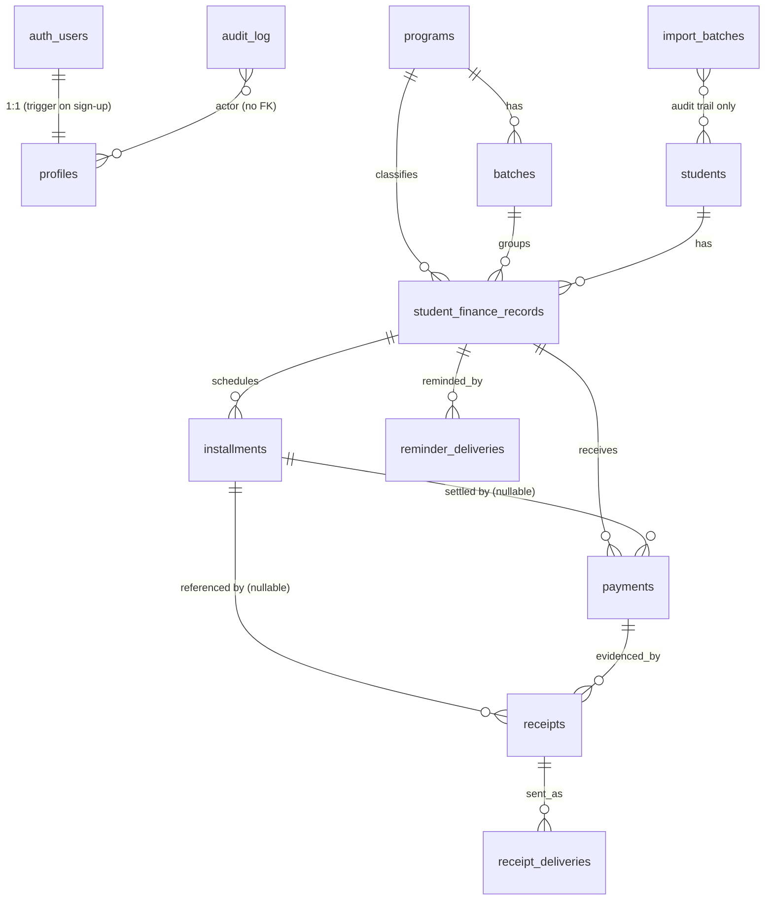

# FINANCE-DATA-01 — Finance data foundation

**Branch:** `feature/finance-data-01`
**Depends on:** FINANCE-BOOTSTRAP-00 (`d554dd0`)
**Status:** implemented; migration **not yet applied** to the hosted project

---

## 1. Scope

Creates the production database foundation for finance tracking: schema,
constraints, indexes, roles, Row Level Security, TypeScript domain types, a
minimal server-side data layer, and the initial program configuration.

Explicitly **not** in this ticket: workbook import, PDF generation, email or
Resend configuration, receipt-number allocation, and any fake student or payment
data. Nothing in this ticket writes a single finance row.

## 2. Files

| File | Change |
| --- | --- |
| `supabase/migrations/20260917143000_finance_foundation.sql` | new — entire schema, RLS, helpers, triggers, indexes |
| `supabase/migrations/20260917150000_initial_program_configuration.sql` | new — the PSW and ECEA program rows (see §3a) |
| `supabase/migrations/README.md` | rewritten — migration inventory and house rules |
| `src/types/finance.ts` | new — domain types for every table |
| `src/lib/finance/query.ts` | new — paging, search escaping, error handling |
| `src/lib/finance/programs.ts` | new — program reads |
| `src/lib/finance/batches.ts` | new — batch reads |
| `src/lib/finance/students.ts` | new — student reads, search, display name |
| `src/lib/finance/finance-records.ts` | new — finance record reads with relations |
| `src/lib/finance/notes.ts` | new — `effectiveNote()`, `defaultNoteFor()` |
| `src/lib/supabase/health.ts` | rewritten — probes `programs` instead of a nonexistent table |
| `src/types/README.md`, `src/lib/finance/README.md`, `scripts/README.md` | updated |

## 3. Schema



Twelve tables in `public`:

| Table | Purpose | Delete allowed? |
| --- | --- | --- |
| `profiles` | role per auth user (`admin` / `finance` / `viewer`) | no |
| `programs` | program configuration and receipt-number components | no |
| `batches` | cohorts within a program; maps to a legacy worksheet | no |
| `students` | people; historical rows may be very incomplete | no |
| `student_finance_records` | a student's money for one program/batch | no |
| `installments` | scheduled items, not confirmed money | no |
| `payments` | money received; voided, never deleted | no |
| `receipts` | one receipt, with an authoritative receipt number | no |
| `receipt_deliveries` | every send attempt for a receipt | no |
| `reminder_deliveries` | every reminder send attempt | no |
| `import_batches` | one import run, for auditability | no |
| `audit_log` | append-only record of sensitive changes | no |

No table grants `DELETE` to any role. Removing financial history is a
deliberate, audited SQL intervention, never something application code can do.

## 3a. Program configuration is delivered by migration

**Initial production program configuration ships as a migration, not as a seed
file that somebody runs by hand.**
`20260917150000_initial_program_configuration.sql` inserts the two program rows
and is applied by the ordinary migration path, in filename order, on every
environment.

This is a correction to an earlier draft, which put the same two rows in
`supabase/seed/001_programs.sql` as an optional step. That was wrong. PSW and
ECEA are not sample data: `student_number_prefix` decides how a student number
is split, and `receipt_course_code` / `receipt_course_suffix` are literal
components of every receipt number the system will ever print. Without these
rows the application cannot number a receipt at all. Configuration the product
cannot run without is production data, and production data does not belong in an
opt-in file whose only enforcement is a line in a README — an environment where
someone skipped step 3 would come up looking healthy and start issuing wrong
receipt numbers. **The seed file has been deleted**, and there is no
`supabase/seed/` directory: nothing now duplicates this logic.

| Field | PSW | ECEA |
| --- | --- | --- |
| `name` | NACC Personal Support Worker | Early Childhood Education Assistant |
| `short_code` | `PSW` | `ECEA` |
| `student_number_prefix` | `125` | `121` |
| `receipt_course_code` | `12500` | `12100` |
| `receipt_course_suffix` | `25` | `21` |
| `active` | `true` | `true` |

**Conflict target.** The upsert targets `on conflict on constraint
programs_short_code_key`, the named unique constraint the foundation migration
declares on `programs.short_code`. Naming the constraint rather than writing a
bare `(short_code)` column list means the statement fails loudly if that
constraint is ever renamed or dropped, instead of silently matching something
else. `short_code` is the stable business key; `id` is a generated uuid and
carries no identity across environments.

**What a re-run does.** `name` and the three numbering columns are overwritten
from the migration — they are authoritative, and a wrong value there produces
wrong receipt numbers on real money. `active` is deliberately **not** in the
`SET` list: it is set on the initial insert, but a re-run never forces it back
to `true`, because deactivating a program is an operational decision an admin
makes in the app and re-applying a file must not silently reverse it. A `WHERE
... IS DISTINCT FROM` clause makes an identical re-run a true no-op, so no row
is rewritten, the `programs_set_updated_at` trigger does not fire, and
`updated_at` keeps telling the truth about when the configuration last changed.

This matters more than usual here because migrations are currently applied by
pasting into the SQL Editor (§10), where an accidental second run is entirely
plausible.

**Nothing else is created.** Two rows in `programs`. No other program is
invented, and no student, batch, finance record, payment or receipt is written
by either migration.

## 4. Legacy-data philosophy

The workbook is the historical record, inconsistencies included. The schema is
built so an import can never be rejected or "helpfully" corrected:

- **`legacy_*` columns hold source values verbatim.** `legacy_total_fee`,
  `legacy_total_paid` and `legacy_balance` are what the sheet said. They are
  never recalculated, and no calculated figure is written back over them.
- **Calculated values live elsewhere.** `current_total_fee` is the
  application's own number. If the two disagree, both survive and the
  disagreement is visible — that is the point of the separation.
- **Almost everything is nullable.** Student names, emails, dates and amounts
  can all be missing. Only structural columns (foreign keys, `amount` on a
  payment) are `NOT NULL`. `receipts.final_receipt_number` is nullable too —
  see §7.
- **`students.student_number` has no unique constraint.** Legacy numbers may
  repeat or be malformed. A constraint would silently reject a real historical
  row, so uniqueness is deferred until import analysis in FINANCE-IMPORT-02.
  For the same reason `findStudentsByNumber()` returns a list, not one row.
- **Raw source is kept.** `payments.legacy_raw_json`,
  `installments.legacy_value_text`, `legacy_source_sheet` and
  `legacy_source_row` make every imported row traceable to its cell.
- **Historical receipt numbers are untouchable.** See §7.

The application never deduplicates, normalizes, back-fills or reconciles
historical rows. New activity, created in the app, is structured.

## 5. Money and time

- Currency is `NUMERIC(12,2)` everywhere. No `REAL`, no `DOUBLE PRECISION`.
  Twelve digits with two decimals covers any realistic tuition figure exactly.
- `payments.amount` is deliberately unconstrained in sign: an `adjustment` may
  be a refund or a correction.
- `student_finance_records.currency` defaults to `'CAD'` and is constrained to
  a three-letter ISO 4217 shape.
- PostgREST serialises `NUMERIC` as a **string**. The TypeScript types reflect
  that (`MoneyString`), so no value silently becomes a float on the way to the
  browser. Parse at the point of calculation, deciding rounding explicitly.
- `created_at` / `updated_at` / all audit and delivery instants are
  `timestamptz`. `payment_date`, `due_date`, `receipt_date`,
  `installment_month`, batch start/end are `date`, where time of day is
  meaningless.
- `updated_at` is maintained by a shared `public.set_updated_at()` trigger on
  every table that has the column. Append-only tables (`receipt_deliveries`,
  `reminder_deliveries`, `import_batches`, `audit_log`) carry `created_at` only
  and stamp their own event times.

## 6. Installments and the default-note rule

An installment is a **scheduled item**, not money. Payments are separate rows,
and a payment may or may not point at one.

Each item carries two notes:

| Column | Written by | Overwritten? |
| --- | --- | --- |
| `default_note` | the system | never |
| `custom_note` | staff | freely |

The effective note is `custom_note ?? default_note`, resolved in application
code by `effectiveNote()` in `src/lib/finance/notes.ts`. Because the default is
never overwritten, clearing an override restores the original note. Nothing in
SQL computes this: a generated column would have baked the rule into the
database, where changing it later is a migration instead of an edit.

`defaultNoteFor()` produces the defaults:

| Item | Default note |
| --- | --- |
| enrollment | `Enrolment fee` |
| monthly, September | `September installment` |
| monthly, month unknown | `Monthly installment` |
| other | none — staff supply the note |

`installment_month` is a `date`, not a month number or an enum, and month names
are derived from the date at render time. Nothing assumes a twelve-month
schedule.

## 7. Receipt numbers

New receipts will eventually be numbered:

```
{PROGRAM}-{COURSE_CODE}-{COURSE_SUFFIX}-{STUDENT_SUFFIX}-{SEQUENCE}
PSW    -12500        -25             -346             -01
```

Each component has a home:

| Component | Source |
| --- | --- |
| `PROGRAM` | `programs.short_code`, copied to `receipts.program_short_code` |
| `COURSE_CODE` | `programs.receipt_course_code` → `receipts.receipt_course_code` |
| `COURSE_SUFFIX` | `programs.receipt_course_suffix` → `receipts.receipt_course_suffix` |
| `STUDENT_SUFFIX` | `students.student_number` minus `programs.student_number_prefix` (`125346` − `125` → `346`) → `receipts.student_suffix` |
| `SEQUENCE` | `receipts.receipt_sequence`, a per-student counter |

All of these are `TEXT`, including the number-like ones. `12500`, `25` and a
prefix such as `125` are identifiers, not quantities: leading zeroes may matter
and arithmetic on them is never meaningful.

**Two number columns, on purpose.** `generated_receipt_number` records what the
numbering engine produced. `final_receipt_number` is authoritative and is what
gets printed and sent. Imported historical receipts carry arbitrary numbers in
`final_receipt_number` that must never be rewritten, and for them
`generated_receipt_number` is simply null. An override is flagged with
`receipt_number_overridden` and explained in
`receipt_number_override_reason`.

**Both number columns are `NULL`-able.** A receipt is created in `'draft'`
status *before* a number exists, because allocating one safely is a
transactional concern that this ticket deliberately does not implement. Making
`final_receipt_number` `NOT NULL` would force the application to invent a
placeholder number just to insert the draft row — exactly the kind of
throwaway value that later gets mistaken for a real receipt number. It stays
null until allocation runs, and historical imports keep whatever value they
already have.

A `CHECK` on each column rejects an empty or whitespace-only string but permits
`NULL`, so "no number yet" is representable and `''` is not. Requiring a number
once a receipt leaves `'draft'` is application-level for now; it is not a
database constraint because the shape of the legacy data has not been analysed
yet (FINANCE-IMPORT-02). There is **no `UNIQUE` constraint** on either column —
see below.

**Why allocation is deferred to FINANCE-RECEIPTS.** Handing out `SEQUENCE`
safely means serialising concurrent allocations for the same student — two staff
generating receipts at once must not both get `-01`. Doing that correctly needs
a transaction strategy (an advisory lock, a unique index with retry, or a
per-student counter row updated with `FOR UPDATE`), and picking one requires the
numbering rules to be settled first. A half-correct implementation now would
produce duplicate receipt numbers on real money, so this migration stores the
components and stops there.

For the same reason there is **no unique constraint** on
`receipts.final_receipt_number` or on `receipts.payment_id`: legacy data may
repeat either. "One payment, one receipt" is enforced in application logic, and
a partial unique index (e.g. on `payment_id where status <> 'void'`) becomes an
option once import analysis proves the historical data supports it.

## 8. Sending and resending

`receipts.status` records history, not permission. A receipt with status `sent`
is **always** eligible for a deliberate resend — there is no `can_send` boolean
anywhere, by design.

Every attempt is a row in `receipt_deliveries`, typed `initial`, `resend` or
`batch`. First sent, last sent and send count are derived from those rows:

```sql
select receipt_id,
       min(sent_at) filter (where status = 'sent') as first_sent_at,
       max(sent_at) filter (where status = 'sent') as last_sent_at,
       count(*)     filter (where status = 'sent') as send_count
from public.receipt_deliveries
group by receipt_id;
```

`reminder_deliveries` works the same way for payment reminders, and additionally
snapshots the subject and body that were actually sent, so a later template
change cannot rewrite history.

Only `provider` and `provider_message_id` are stored for the mail provider.
**No API keys or secrets are ever stored in the database.** `error_summary` is a
short description, never a payload.

## 9. Roles and Row Level Security

Roles live in `public.profiles.role`: `admin`, `finance`, `viewer`. A trigger on
`auth.users` creates a **`viewer`** profile for every new sign-up. Nobody is
ever made admin automatically.

Four helper functions read the caller's own profile. `current_app_role()` is
`SECURITY DEFINER` so that a policy on `profiles` can consult `profiles` without
recursing through its own RLS:

| Function | True for |
| --- | --- |
| `public.current_app_role()` | returns the role, or NULL when signed out or deactivated |
| `public.is_admin()` | `admin` |
| `public.can_write_finance()` | `admin`, `finance` |
| `public.can_read_finance()` | `admin`, `finance`, `viewer` |

### `SECURITY DEFINER` precautions

`current_app_role()` is the only function in the migration that is elevated for
its own sake. `is_admin()`, `can_write_finance()` and `can_read_finance()` are
plain `STABLE` `SECURITY INVOKER` wrappers around it, so the elevation is
confined to one small function instead of spread across four.

- **Pinned `search_path`.** Every function — elevated or not, including the
  trigger functions — is declared `set search_path = ''`. No object name is
  resolved through a caller-controlled `search_path`, so a user cannot shadow
  `profiles` or `uid()` with something of their own.
- **Everything is schema-qualified**: `public.profiles`, `auth.uid()`,
  `public.is_admin()`. With an empty `search_path` this is required, and it
  also makes the intent unambiguous on review.
- **No dynamic SQL.** No `EXECUTE`, no string concatenation, no `format()`
  anywhere in the migration — there is no injection surface to defend.
- **The role lookup cannot be steered by the caller.** `current_app_role()`
  takes no arguments and its `WHERE` clause is pinned to
  `p.id = (select auth.uid())`. A caller cannot ask about another user's row,
  and cannot substitute their own identity, because `auth.uid()` comes from the
  verified JWT rather than from anything the client supplies.
- **The underlying row is not user-writable.** The role only *matters* because
  `profiles.role` cannot be edited by its owner — see
  *Self-escalation* below. An elevated read of a table the user can write would
  be worthless.
- **`EXECUTE` is granted explicitly, not inherited.** Postgres grants `EXECUTE`
  on every new function to `PUBLIC`. §17 of the migration revokes that and
  re-grants deliberately:

  | Function | `EXECUTE` |
  | --- | --- |
  | `current_app_role()`, `is_admin()`, `can_write_finance()`, `can_read_finance()` | `authenticated` only (revoked from `PUBLIC`, `anon`) |
  | `set_updated_at()`, `handle_new_user()`, `guard_profile_privilege_change()` | nobody (revoked from `PUBLIC`, `anon`, `authenticated`) |

  `authenticated` needs `EXECUTE` on the four helpers because RLS policies
  evaluate them as the calling role. The trigger functions need no grant at all:
  Postgres checks `EXECUTE` on a trigger function when the **trigger is
  created**, not each time it fires, so the triggers keep working while direct
  calls are refused.

  Calling `current_app_role()` as `anon` would have returned NULL and leaked
  nothing even before the revoke. It is revoked anyway: an unnecessary grant on
  a `SECURITY DEFINER` function is the kind of thing that turns into a real hole
  when the function is later extended.

### Anonymous and deactivated callers

**Anonymous.** `auth.uid()` is NULL, so `current_app_role()` matches no row and
returns NULL; all three helpers `coalesce` to false. Independently, every policy
targets `to authenticated`, so an anonymous session matches no policy in the
first place, and `anon` holds no table grants. Three separate barriers, any one
of which is sufficient.

**Deactivated (`active = false`).** `current_app_role()` filters on
`and p.active`, so a deactivated profile resolves to NULL and every helper
returns false. The effect is total: **no read and no write of any finance
table**, for a former admin exactly as much as for a former viewer. Access ends
at the next request; no session needs to be revoked for the block to take
effect, because the role is resolved per statement rather than cached in the
JWT.

The one thing a deactivated user can still do is `select` their **own**
`profiles` row, via `profiles_select_self`. That is intentional — it lets the
app say "your account has been deactivated" instead of failing opaquely — and
it exposes only their own name, email, role and `active` flag.

### Self-escalation

A normal authenticated (`finance` or `viewer`) user cannot:

| Attempt | Blocked by |
| --- | --- |
| change their own `role` | no self-`UPDATE` policy on `profiles`; `UPDATE` matches only `profiles_update_admin`, which requires `is_admin()` |
| promote themselves to `admin` or `finance` | same — it is an `UPDATE` on `profiles` |
| reactivate themselves after `active = false` | same, and `is_admin()` is already false for them because `current_app_role()` filters on `active` |
| update another user's profile | same policy; `is_admin()` is false |
| insert a fresh profile row for themselves | `profiles_insert_admin` requires `is_admin()`; the `id` is also a primary key referencing `auth.users`, so a second row is impossible |
| have a profile created with a privileged role at sign-up | `handle_new_user()` hard-codes `'viewer'` — the role is not read from the sign-up payload or user metadata |

`public.guard_profile_privilege_change()`, a `BEFORE UPDATE` trigger on
`profiles`, enforces the same rule a second time at a different layer: if a
permissive self-service policy is ever added by mistake, `role` and `active`
still cannot be changed on the caller's own account. It raises `42501` when a
non-admin changes either column, or when any user — admin included — changes
either column on their own row.

It passes changes through untouched when `auth.uid()` is NULL. That is the
`service_role` / SQL-editor path, which is how the first admin is bootstrapped
and how server-side administration will work later; it is not reachable from a
browser session using the publishable key.

**Admin role management still works.** An admin passes `is_admin()` and may
update any profile other than their own, so promoting, demoting and deactivating
other accounts is unaffected. Demoting or deactivating *yourself* is the SQL
editor's job, which also means the last admin cannot accidentally lock everyone
out from the UI. No role-management UI is built in this ticket.

### Policy matrix

| Table | SELECT | INSERT / UPDATE | DELETE |
| --- | --- | --- | --- |
| `programs` | read finance | **admin only** | — |
| `batches` | read finance | write finance | — |
| `students` | read finance | write finance | — |
| `student_finance_records` | read finance | write finance | — |
| `installments` | read finance | write finance | — |
| `payments` | read finance | write finance (void, not delete) | — |
| `receipts` | read finance | write finance | — |
| `receipt_deliveries` | read finance | write finance | — |
| `reminder_deliveries` | read finance | write finance | — |
| `import_batches` | read finance | write finance | — |
| `audit_log` | **admin only** | INSERT only, `actor_user_id` must equal `auth.uid()` | — |
| `profiles` | own row, or any row for admin | **admin only** | — |

where *read finance* = `can_read_finance()` and *write finance* =
`can_write_finance()`.

Notes on the deliberate asymmetries:

- **Programs are admin-write** because they determine receipt-number components;
  editing one changes how future receipts are numbered.
- **Batches are finance-write** because staff create cohorts routinely.
- **`audit_log` is asymmetric on purpose** — see below.
- **`profiles` has no self-update policy**, so a `finance` or `viewer` account
  cannot promote itself. See *Self-escalation*.

### `audit_log` permissions

| Caller | SELECT | INSERT | UPDATE | DELETE |
| --- | --- | --- | --- | --- |
| `admin` | yes | yes, `actor_user_id` = self | no policy | no policy |
| `finance` | **no** | yes, `actor_user_id` = self | no policy | no policy |
| `viewer` | no | no | no policy | no policy |
| anonymous | no | no | no policy | no policy |

Finance staff write the trail but do not read it: reading is an oversight
function, and nothing in the product needs a finance user to see it yet. The
grant can be widened later; starting narrow means it is a deliberate decision
when it is.

`audit_log` has **no `UPDATE` and no `DELETE` policy at all**, so no
authenticated session can rewrite or erase the trail through PostgREST,
whatever its role. The table grant is `select, insert` only.

`actor_user_id` must equal `auth.uid()` exactly, and NULL is rejected too: an
authenticated session may not write an unattributed entry, because an
unattributed entry is indistinguishable from a forged one. Writing on behalf of
another actor is therefore possible only through `service_role`, which bypasses
RLS — that is the deliberately secured server mechanism a later ticket will
build on, and it is never reachable from the browser. The column itself has no
foreign key, so the trail survives the deletion of the user who acted.

Rows are written by explicit application helpers in a later ticket. There are no
blanket triggers over the finance tables: a trigger system that silently misses
a path is worse than an audit trail whose call sites are visible in the code.

### Unauthenticated access

Every policy targets the `authenticated` role, so an anonymous caller — the
publishable key with no session — matches no policy and reads nothing. RLS is
enabled on all twelve tables.

The service-role key bypasses RLS entirely and is **never** used from client
code. `createServiceRoleClient()` in `src/lib/supabase/server.ts` remains
unused; nothing in this ticket needed it.

### Bootstrapping the first admin

Run once in the Supabase SQL Editor, after the person has signed up through the
app:

```sql
-- Confirm the account exists and see its current role.
select id, email, role, active from public.profiles order by created_at;

-- Promote exactly one account.
update public.profiles
set role = 'admin'
where email = 'the.person@example.com';
```

Thereafter, role changes are made by an admin. There is no role-management UI
yet, by ticket scope.

## 10. Applying the migration

The Supabase CLI is available via `npx supabase` (v2.117.0), but this project is
**not linked**: there is no `supabase/config.toml`, no access token and no
linked project ref. Linking needs credentials that must not be requested or
pasted into a chat, and there is no local Postgres or Docker on this machine, so
the migration has been **written but not executed**.

### Manual application (current path)

1. Open the Supabase dashboard → **SQL Editor** for the project.
2. Paste the entire contents of
   `supabase/migrations/20260917143000_finance_foundation.sql` and run it.
3. Paste the entire contents of
   `supabase/migrations/20260917150000_initial_program_configuration.sql` and
   run it. This step is **not optional** — see §3a.
4. Verify with the read-only checks in §11.

Run them in filename order. Step 3 depends on the `programs` table and on the
`programs_short_code_key` constraint that step 2 creates.

### CLI application (once someone links the project)

```bash
npx supabase login                      # interactive, run it yourself
npx supabase link --project-ref <ref>   # prompts for the DB password
npx supabase db diff --linked           # review what would change — do this first
npx supabase db push                    # applies pending migrations only
```

`db push` applies new migration files and nothing else.
**Never run `supabase db reset` against the hosted project** — it drops and
recreates the database. It is only ever acceptable against a local stack.

## 11. Verification (all read-only)

```sql
-- Tables created, and RLS on for all twelve.
select tablename, rowsecurity
from pg_tables
where schemaname = 'public'
order by tablename;

-- Policies, by table.
select tablename, policyname, cmd, roles
from pg_policies
where schemaname = 'public'
order by tablename, policyname;

-- No DELETE policy should appear anywhere.
select count(*) as delete_policies
from pg_policies
where schemaname = 'public' and cmd = 'DELETE';

-- Money columns must all be numeric.
select table_name, column_name, data_type, numeric_precision, numeric_scale
from information_schema.columns
where table_schema = 'public'
  and data_type in ('real', 'double precision');   -- expect zero rows

-- Receipt numbers must both be nullable, and neither may be UNIQUE.
select column_name, is_nullable
from information_schema.columns
where table_schema = 'public' and table_name = 'receipts'
  and column_name in ('final_receipt_number', 'generated_receipt_number');
-- expect: both YES

select conname, contype
from pg_constraint
where conrelid = 'public.receipts'::regclass and contype = 'u';
-- expect zero rows

-- Every SECURITY DEFINER function must pin its search_path.
select p.proname, p.prosecdef, p.proconfig
from pg_proc p
join pg_namespace n on n.oid = p.pronamespace
where n.nspname = 'public'
order by p.proname;
-- expect: current_app_role and handle_new_user have prosecdef = true,
--         and every row has proconfig = {search_path=""}

-- EXECUTE privileges: PUBLIC and anon must hold none.
select p.proname,
       has_function_privilege('anon',          p.oid, 'execute') as anon,
       has_function_privilege('authenticated', p.oid, 'execute') as authenticated
from pg_proc p
join pg_namespace n on n.oid = p.pronamespace
where n.nspname = 'public'
order by p.proname;
-- expect: anon false everywhere; authenticated true only for the four
--         role helpers, false for the three trigger functions.

-- Program configuration: exactly two rows, with the confirmed values.
select short_code, name, student_number_prefix,
       receipt_course_code, receipt_course_suffix, active
from public.programs
order by short_code;
-- expect exactly:
--   ECEA | Early Childhood Education Assistant | 121 | 12100 | 21 | t
--   PSW  | NACC Personal Support Worker        | 125 | 12500 | 25 | t

-- No operational data was created by either migration.
select
  (select count(*) from public.students)                as students,
  (select count(*) from public.batches)                 as batches,
  (select count(*) from public.student_finance_records) as finance_records,
  (select count(*) from public.payments)                as payments,
  (select count(*) from public.receipts)                as receipts;
-- expect: all zero

-- audit_log: admin-only SELECT, insert gated on actor_user_id, nothing else.
select policyname, cmd, qual, with_check
from pg_policies
where schemaname = 'public' and tablename = 'audit_log';
-- expect exactly two rows: SELECT (is_admin) and INSERT
--         (can_write_finance and actor_user_id = auth.uid())
```

A signed-in `finance` or `viewer` session can also be checked directly: with
that session, `update public.profiles set role = 'admin' where id = auth.uid();`
must affect **zero rows** (no policy matches), and the same statement run after
any future policy change must raise `42501` from
`guard_profile_privilege_change()`. Setting `active = false` on a profile must
make every finance `select` return zero rows for that user on their next
request.

Application-side, with the dev server running: `GET /api/health` reports
`supabase: "connected"` once the migration is applied, and
`supabase: "schema-missing"` before it (verified: it currently reports
`schema-missing`, which is correct while the migration is pending). It returns a
status string and environment-variable **presence booleans** only — never a key,
a URL, a row or a count. The Settings page shows the same status.

The probe is `select('id').limit(0)` on `programs`, **not** a `head: true`
count. A HEAD response has no body, and postgrest-js turns a bodyless 404 into a
204 with `error === null` — so with a head request a missing table is
indistinguishable from a healthy one, which is exactly the case this check
exists to catch. `limit(0)` returns no rows and still surfaces the real error
code.

Nothing above creates a row. No test students, payments or receipts were
created anywhere.

## 12. Rollback

The migration is additive: it creates tables, functions, triggers, indexes and
policies, and alters nothing that existed before. Rolling back therefore means
dropping what it created — destructive by nature, so it is **not** scripted
here and must not be run once real data exists.

Before any data is imported, a clean reversal is:

```sql
-- Review first. This destroys every finance table and everything in them.
drop trigger if exists on_auth_user_created on auth.users;

drop table if exists public.audit_log, public.import_batches,
  public.reminder_deliveries, public.receipt_deliveries, public.receipts,
  public.payments, public.installments, public.student_finance_records,
  public.students, public.batches, public.programs cascade;

-- profiles is dropped separately: it is the role model, not finance data.
drop table if exists public.profiles cascade;

drop function if exists public.can_read_finance(), public.can_write_finance(),
  public.is_admin(), public.current_app_role(), public.handle_new_user(),
  public.guard_profile_privilege_change(), public.set_updated_at();
```

After import, rollback is a restore from a Supabase backup, not a `drop`. The
`legacy_*` columns and `legacy_raw_json` exist partly so a bad import can be
identified and re-done rather than reverse-engineered.

Re-running the migration itself is safe: it uses `if not exists`,
`create or replace` and `drop policy if exists`. Note the limit of that safety —
`create table if not exists` does **not** reconcile a table that already exists,
so a later column or constraint change needs its own migration file.

## 13. Generated database types

`src/types/finance.ts` is hand-written and is the source of truth today.

If generated types are wanted later, with the project linked:

```bash
npx supabase gen types typescript --linked --schema public > src/types/database.ts
```

Rules: write them to `src/types/database.ts`, never over `finance.ts`; commit
them as their own change so the diff is reviewable; and wire them in by typing
the client (`createServerClient<Database>(...)`) rather than by duplicating row
shapes. The domain types stay, because they carry meaning the generator cannot —
`MoneyString`, `AppRole`, the note pair, the receipt-number parts.

## 14. What remains

**FINANCE-RECEIPTS** — receipt-number allocation with a real concurrency
strategy, PDF generation into `receipts.pdf_storage_path`, and the send/resend
workflow writing `receipt_deliveries`.

**FINANCE-IMPORT-02** — read the workbook, map sheets to batches via
`batches.legacy_sheet_name`, write rows as-is into the `legacy_*` columns,
record the run in `import_batches`, and report what it skipped. The import
analysis it produces decides whether `students.student_number` and
`receipts.payment_id` can take unique constraints.

**Later** — role management UI, payment void UI, application-level audit helpers
writing `audit_log`, reminder scheduling, Excel export, and the finance grid.

## 15. Assumptions

1. ~~**ECEA's display name.**~~ **Resolved.** The placeholder is gone. The
   confirmed name `Early Childhood Education Assistant` (`short_code` `ECEA`,
   prefix `121`, course code `12100`, suffix `21` — the receipt-code values were
   already correct and are unchanged) now ships in
   `20260917150000_initial_program_configuration.sql`, alongside PSW's supplied
   `NACC Personal Support Worker`. See §3a.
2. **Programs are admin-write, batches are finance-write.** The ticket separates
   "application finance tables" (admin) from "finance operational tables"
   (finance) without listing which is which; program configuration drives
   receipt numbering, so it sits on the admin side.
3. ~~**`receipts.final_receipt_number` is `NOT NULL`.**~~ **Reversed on
   review.** Both `final_receipt_number` and `generated_receipt_number` are
   nullable. A `draft` receipt legitimately exists before a race-condition-safe
   number has been allocated, and historical imports must be free to preserve
   arbitrary existing values. No `UNIQUE` constraint is added in this ticket,
   and allocation is still FINANCE-RECEIPTS work. See §7.
4. **Status vocabularies** (`scheduled`/`partial`/`paid`/`waived`/`cancelled`,
   `pending`/`running`/`completed`/`failed`/`rolled_back`,
   `queued`/`sent`/`failed`/`bounced`, and the finance-record statuses) were not
   specified. They are `TEXT` with `CHECK` constraints rather than Postgres
   enums, so adding a value later is a one-line migration instead of a type
   alteration.
5. **Anonymous callers get zero rows, not an error.** Table privileges are left
   as Supabase grants them and RLS is the gate, which is the standard Supabase
   model and keeps the health probe working for signed-out requests. Function
   privileges are *not* left at their defaults — see *`SECURITY DEFINER`
   precautions* in §9.
6. **The migration is unverified against a real database.** There is no local
   Postgres, no Docker and no linked project here, so it has been reviewed by
   hand but never executed. Run it in the SQL Editor and check §11.
